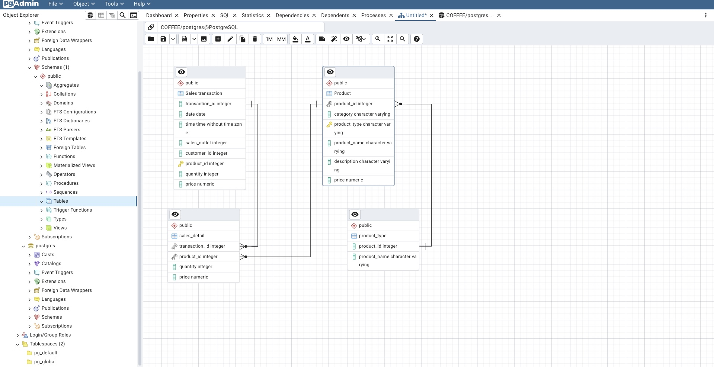

# database-design-postgresql-msql
Relational database design and implementation using PostgreSQL and MySQL, based on a simulated coffee shop business scenario.

# Database Design and Implementation — PostgreSQL and MySQL

## Project Description

This project simulates a real-world Data Engineering scenario for a coffee shop chain based in New York that plans to expand nationwide by opening new franchise locations.

The company currently stores its information across different systems and formats, including spreadsheets, CSV files, Point of Sale (POS) systems, Customer Relationship Management (CRM) systems, and supplier databases.

The goal of the project is to design and implement a centralized relational database that enables the company to organize and manage its data efficiently and facilitates access to information to support business decision-making.

The project was developed using PostgreSQL and MySQL.

**Context:** Practical project developed as part of the IBM Data Engineering program, based on a simulated business scenario.

## Database Design

The database structure was designed using an Entity-Relationship Diagram (ERD) in pgAdmin.

### Entity-Relationship Diagram

## Project Objectives

The main objectives of the project were:

- Identify the entities and attributes present in the data.
- Design a relational data model.
- Create an Entity-Relationship Diagram (ERD).
- Normalize the tables.
- Define primary and foreign keys.
- Establish relationships between the different entities.
- Create database objects using SQL.
- Implement the database using PostgreSQL.
- Create views and materialized views.
- Export data subsets.
- Import data into MySQL using phpMyAdmin.

##  Data Sources

The information used in the project comes from different sources:

- Headquarters (HQ) spreadsheets: staff information.
- Headquarters (HQ) spreadsheets: sales outlet information.
- POS system: sales data in CSV format.
- CRM system: customer data in CSV format.
- Supplier database: product information.

The project involves centralizing these data sources into a relational database.

## Technologies and Tools

- PostgreSQL
- MySQL
- SQL
- pgAdmin
- phpMyAdmin
- CSV

## Repository Structure

The repository is organized as follows:

- **ERD/** — Contains the Entity-Relationship Diagram (ERD) of the database.
- **PostgreSQL/** — Contains the SQL scripts used to create the database structure and load the data.
- **exports/** — Contains the datasets exported from the PostgreSQL view and materialized view.

### PostgreSQL Files

- **`GeneratedScript.sql`** — Contains the SQL script generated from the ERD to create the database tables, primary keys, foreign keys, and relationships.

- **`CoffeeData.sql`** — Contains the data used to populate the PostgreSQL database.

### Exported Data

- **`staff_locations_view.csv`** — Contains the data exported from the PostgreSQL view created to provide staff and location information.

- **`product_info_m-view.csv`** — Contains the data exported from the PostgreSQL materialized view created to provide product information.

## Database Tables

The PostgreSQL database includes the following tables:

- `staff`
- `sales_outlet`
- `customer`
- `sales_transaction`
- `sales_detail`
- `product`
- `product_type`

### Table Description

| Table | Description |
|---|---|
| `staff` | Stores information about the coffee shop employees. |
| `sales_outlet` | Stores information about the different sales locations. |
| `customer` | Stores customer information. |
| `sales_transaction` | Stores information about sales transactions. |
| `sales_detail` | Stores the details associated with each sales transaction. |
| `product` | Stores information about the products sold by the company. |
| `product_type` | Stores information used to classify the different products. |
